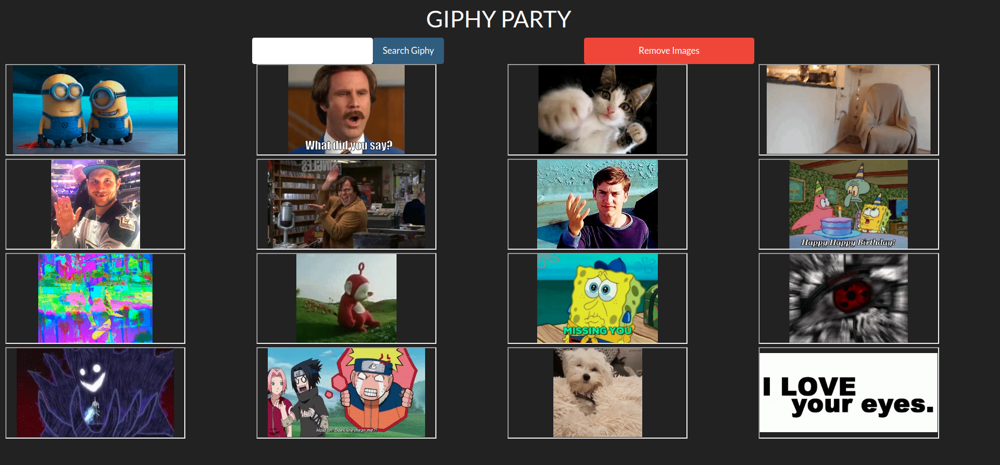

# GIPHY Party Documentation

For this exercise we will be using the Giphy API! This will require you to use an API key and understand some of the documentation about the API, which you can see [here](https://github.com/Giphy/GiphyAPI).

Here is what the URL would look like for search term of "hilarious" - http://api.giphy.com/v1/gifs/search?q=hilarious&api_key=3ejnZPnQHUneTCi7oxzIep8mGWBgY0PP. You can click on this URL and see the JSON you will get back. To view this in a nicer format, we highly recommend using the JSON Viewer chrome extension.

Your application should do the following:

- Allow the user to search for a GIF and when the form is submitted, make an AJAX request using Lifecycle component to the Giphy API and return a single GIF
- Once the Giphy API has responded with data, append the GIF to the page
- Allow the user to search for as many GIFs as they would like and keep appending them to the page
- Allow the user to remove all of the GIFs by clicking a button

Here is an example of what the application might look like:

## How to run

In the project directory, you can run:

### `npm install or yarn install`

First, you have to install all dependencies/libraries.

### `npm start or yarn start`

Runs the app in the development mode. 
Open [http://localhost:3000](http://localhost:3000) to view it in the browser.

The page will reload if you make edits. 
You will also see any lint errors in the console.
