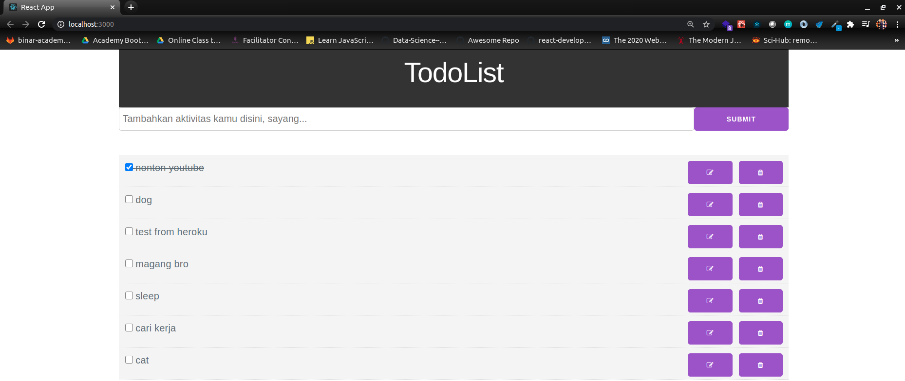

# TodoList Documentation

For this exercise we will create TodoList Web App.

Here is an example of what the application might look like:

## How to run

In the project directory, you can run:

### `npm install or yarn install`

First, you have to install all dependencies/libraries.

### `npm start or yarn start`

Runs the app in the development mode. 
Open [http://localhost:3000](http://localhost:3000) to view it in the browser.

The page will reload if you make edits. 
You will also see any lint errors in the console.
